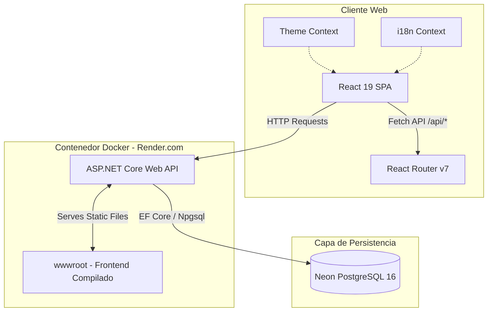

# RestoApp — Sistema de Facturación y Gestión para Restaurantes 🚀

[](https://dotnet.microsoft.com/download/dotnet/10.0)
[](https://react.dev/)
[](https://www.typescriptlang.org/)
[](https://www.postgresql.org/)
[](https://www.docker.com/)
[](https://render.com/)

**RestoApp** es una solución web moderna y robusta para la gestión operativa y facturación de restaurantes. Diseñada bajo un esquema desacoplado con un backend de alto rendimiento en C# y un frontend SPA interactivo en React, la aplicación está totalmente optimizada para contenedores Docker y despliegues en la nube de alta disponibilidad.

---

## 🔗 Demo en Vivo

> [!TIP]
> 🌐 **[Accede al Demo en Render aquí](https://facturacion-restaurante.onrender.com)** *(Nota: Al estar en el plan gratuito de Render, el primer acceso puede demorar ~50 segundos en arrancar mientras el contenedor se reactiva).*
>
> 🛢️ **Base de Datos Activa:** Alojada permanentemente en la nube serverless de [Neon.tech](https://neon.tech/).

---

## 🏗️ Diagrama de Arquitectura y Flujo de Datos

El siguiente diagrama detalla cómo interactúan los componentes en producción bajo una arquitectura de **un solo contenedor** sirviendo API y contenido estático:



---

## 🛠️ Stack Tecnológico

### Backend (FacturacionRestaurante.Server)
* **Framework:** .NET 10 (Web API) usando C# moderno (constructores primarios, records inmutables para DTOs).
* **ORM & Acceso a Datos:** Entity Framework Core con el driver oficial **Npgsql.EntityFrameworkCore.PostgreSQL**.
* **Base de Datos:** PostgreSQL 16 (local con Docker / producción en Neon).
* **Generación de Reportes:** **ClosedXML** para la exportación de informes analíticos en Excel de forma nativa.

### Frontend (facturacionrestaurante.client)
* **Framework:** React 19 con TypeScript para tipado estático seguro.
* **Empaquetador (Bundler):** Vite (desarrollo rápido y HMR instantáneo).
* **Navegación:** React Router DOM (v7).
* **Impresión de Comprobantes:** **jsPDF** para generar boletas y pre-cuentas estilizadas en formato PDF directamente en el cliente.
* **Estilos:** Vanilla CSS moderno con arquitectura de variables dinámicas para soporte nativo de temas.

---

## 📁 Estructura Modular del Frontend

El frontend se diseñó aplicando principios de modularidad y responsabilidad única:

```
facturacionrestaurante.client/src/
├── context/
│   └── AppContext.tsx        # Contexto global de internacionalización (i18n) y tema (Claro/Oscuro)
├── types/
│   └── index.ts              # Modelos, contratos y tipos de TypeScript comunes
├── utils/
│   └── api.ts                # Cliente HTTP unificado con políticas de reintento y control de errores
├── pages/
│   ├── InicioPage.tsx        # Dashboard analítico con KPIs e histograma interactivo de ingresos
│   ├── MesasPage.tsx         # Gestión de salón (pedidos, precuenta, cobros y generación de PDF)
│   ├── PedidosPage.tsx       # Comanda interactiva de platos y bebidas
│   ├── ProductosConfiguracionPage.tsx # CRUD completo para administración de la carta
│   ├── InformesPage.tsx      # Exportaciones analíticas a Excel de informes detallados
│   └── ConfiguracionPage.tsx # Opciones de personalización del sistema
```

---

## ⚙️ Características Clave

1. **Base de Datos Autogestionada:** Al arrancar la aplicación, Entity Framework Core ejecuta `db.Database.EnsureCreated()`, creando el esquema y poblando los datos semilla (platos, bebidas, mesas iniciales) de forma automática si no existen.
2. **Generación Dinámica de PDFs:** Generación en el cliente de boletas listas para impresión térmica o estándar con marcas visuales corporativas.
3. **Modo Claro / Oscuro Dinámico:** Alterna la apariencia del sistema instantáneamente manipulando variables CSS globales.
4. **Localización Multilingüe (i18n):** Soporte completo para Español, Inglés y Portugués, traduciendo toda la interfaz en tiempo real.
5. **Contenerización Docker:** Configurado con un Dockerfile optimizado para entornos de despliegue rápido.

---

## ⚙️ Guía de Ejecución Local

### Opción A: Ejecución Tradicional (Recomendado para Desarrollo)

#### Requisitos Previos:
* SDK de .NET 10.
* Node.js (v18 o superior).
* Una instancia de PostgreSQL corriendo localmente.

#### Configuración:
1. Copia o crea un archivo `.env` en la raíz del proyecto (o usa el archivo `.env.local` generado por el Neon CLI).
2. Asegúrate de configurar la variable de entorno `DATABASE_URL`:
   ```bash
   DATABASE_URL="Host=localhost;Port=5432;Database=FacturacionRestauranteDb;Username=postgres;Password=tu_password"
   ```
3. Ejecuta la restauración de paquetes e instala dependencias del frontend:
   ```bash
   cd facturacionrestaurante.client
   npm install
   ```
4. Corre el proyecto de backend:
   ```bash
   cd ../FacturacionRestaurante.Server
   dotnet run
   ```
5. El backend iniciará en el puerto local y levantará automáticamente el servidor de desarrollo de React mediante el proxy configurado en `launchSettings.json`. Abre `https://localhost:54876` en tu navegador.

### Opción B: Ejecución con Docker Compose (Base de datos local)

Si prefieres no instalar PostgreSQL de forma nativa, puedes levantar la base de datos y la consola de administración PgAdmin usando Docker Compose:
```bash
docker-compose up -d
```
* **PostgreSQL:** Disponible en `localhost:5432` con usuario `postgres` y contraseña `postgres`.
* **PgAdmin:** Accede a `http://localhost:5050` (Email: `admin@admin.com`, Contraseña: `admin`) para administrar visualmente los datos.

---

## 🚀 Estrategia de Despliegue en Producción

El proyecto está diseñado bajo el principio de **Single Container Deploy** (Despliegue de un solo contenedor):
* La primera fase del [`Dockerfile`](file:///c:/Users/adria/source/repos/Bloddy20Moon/FacturacionRestaurante/Dockerfile) compila el frontend de React.
* Los recursos resultantes (`/dist`) se copian en el directorio `/wwwroot` del backend .NET.
* .NET se encarga de servir las APIs en las rutas `/api/*` y mapear el fallback de cualquier otra ruta hacia `index.html` para el enrutamiento del lado del cliente de React.
* El despliegue de producción se conecta mediante la cadena de conexión directa `DATABASE_URL` a una base de datos PostgreSQL Serverless hospedada en **Neon.tech**, optimizando el rendimiento mediante el apagado automático de cómputo inactivo y persistencia indefinida.

---

## 🗺️ Roadmap: Próximos Pasos (Visión de Producto)

Para llevar esta aplicación al nivel de un producto comercial de gran escala, se tienen proyectadas las siguientes mejoras arquitectónicas:

1. **Tiempo Real con SignalR:** Implementar WebSockets para que el módulo de Cocina reciba las comandas ingresadas por los meseros al instante y sin recargar pantallas.
2. **Seguridad con JWT y RBAC:** Incorporar inicio de sesión seguro y restricción de endpoints según el rol del empleado (ej: Mesero solo crea comandas, Administrador gestiona precios y reportes financieros).
3. **Migración a Clean Architecture (CQRS):** Separar las consultas y comandos utilizando MediatR para desacoplar el servicio `BillingService` en casos de uso específicos y testeables en aislamiento.
4. **Pruebas de Integración con Testcontainers:** Añadir una suite de pruebas automatizadas que levante una base de datos PostgreSQL en Docker al vuelo para verificar la persistencia sin ensuciar producción.
